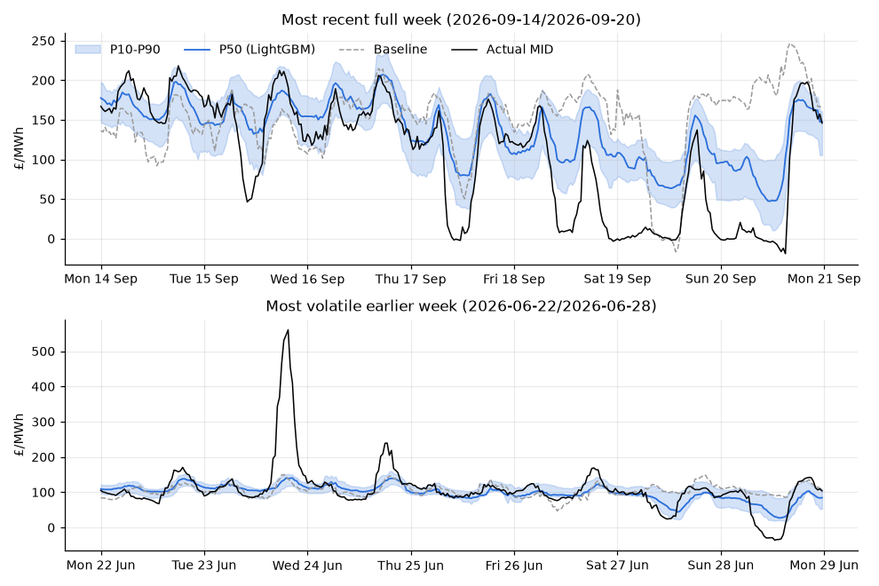
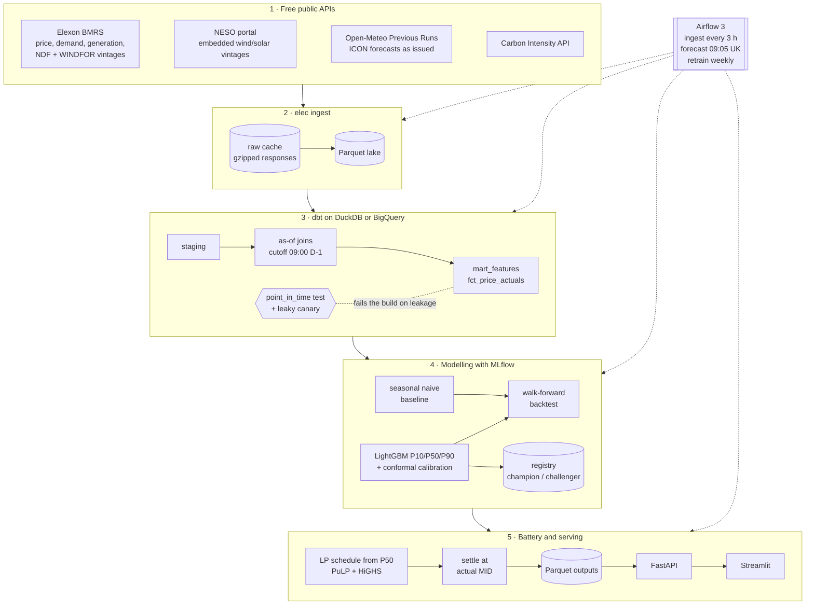

# GB Day-Ahead Electricity Price Forecasting

[](https://github.com/ssabeeth/electricity/actions/workflows/ci.yml)
[](https://github.com/ssabeeth/electricity/actions/workflows/track-record.yml)

**Live dashboard: [ukelectricity.streamlit.app](https://ukelectricity.streamlit.app)** ·
**Live track record: [`track-record` branch](https://github.com/ssabeeth/electricity/tree/track-record)**

A production-style pipeline that forecasts the next day's **half-hourly GB
electricity price** as P10 / P50 / P90. Every forecast uses only information
available at a **09:00 UK cutoff on the day before delivery**, and forecast
quality is converted into **£ through a battery arbitrage simulation**. It
ingests four free public data sources, builds point-in-time features in dbt,
trains calibrated LightGBM quantile models tracked in MLflow, and is
orchestrated by Airflow. A FastAPI service and a Streamlit dashboard serve the
results, and the whole stack runs from one `make up`.

> **Target, stated plainly.** GB day-ahead *auction* prices (EPEX / N2EX) are
> not available from any free API. This project forecasts the **Elexon Market
> Index Price (MID, APXMIDP)**, the free half-hourly reference price for
> short-term GB trading. See [Known limitations](#known-limitations).

## Live track record

Every morning since 24 September 2026, a GitHub Actions job forecasts the next
day. It commits the forecast and the battery schedules to the
[`track-record` branch](https://github.com/ssabeeth/electricity/tree/track-record)
**before the delivery day starts**, and scores them once Elexon publishes the
prices. Nothing published there is ever edited, so unlike the backtest below it
cannot have been tuned with hindsight. The model is refitted at the start of
each month on every day up to two days before, the backtest's own protocol, so
the live numbers test the backtest's claims directly. Each model is published
as a hashed release and named in every forecast it makes. The branch's README
carries the running totals: coverage, pinball skill against the baseline, and
cumulative battery £ against perfect foresight.

It runs for free: GitHub Actions for the pipeline and Streamlit Community Cloud
for the [dashboard](https://ukelectricity.streamlit.app). See
[docs/deploy_streamlit.md](docs/deploy_streamlit.md).

## Results

Out-of-sample: 19 monthly walk-forward folds (Mar 2025 to Sep 2026), 27,344
half-hours, expanding training window from Mar 2024. The two modelling choices
(target transform and calibration variant) were made on folds 1-6 only. Folds
7-19 are reported separately as out-of-sample for those choices. The LightGBM
hyperparameters are hand-set and were not tuned.

| Model | Pinball loss | Skill vs baseline | MAE (P50) | P10-P90 coverage (nominal 80%) | Interval width |
|---|---|---|---|---|---|
| Seasonal naive baseline (same half-hour last week) | 9.79 | — | £27.47 | 78.4% | £87.7 |
| **LightGBM quantile, conformally calibrated** | **5.05** | **48.4%** | **£15.48** | **78.7%** | **£46.1** |
| … hold-out folds only | 5.34 | 48.7% | £16.39 | 77.5% | £47.4 |

Both models are well calibrated. LightGBM halves the pinball loss and the MAE
with an interval half as wide. In £, on a 1 MW / 2 MWh battery over 568 settled
out-of-sample days:

| Battery strategy (schedule fixed at 09:00 D-1, settled at actual prices) | Net £ | £ per MW-year | Share of perfect foresight |
|---|---|---|---|
| Perfect foresight (upper bound) | £57,940 | £37,232 | 100% |
| **Schedule from the LightGBM P50** | **£42,162** | **£27,094** | **72.8%** |
| Schedule from the seasonal naive forecast | £27,036 | £17,373 | 46.7% |
| Fixed "charge overnight, discharge at the evening peak" rule (lower bound) | £2,450 | £1,574 | 4.2% |

**The better forecast is worth about £9,700 per MW per year** on the same asset
with the same optimiser. Full reports: [backtest](reports/backtest.md),
[battery](reports/battery.md), [leakage experiment](reports/leakage_experiment.md).




## Why the numbers can be trusted

Price-forecasting backtests usually flatter themselves through leakage. This
project treats that as the main engineering problem.

1. **One decision cutoff, enforced in the warehouse.** Every forecast input
   (NESO demand and wind forecasts, embedded solar, weather) is stored as
   *vintages* with their issue time. The feature mart takes, for each delivery
   half-hour, the latest vintage issued at or before **09:00 UK on D-1**
   (DST-aware). Every feature group carries the timestamp of its newest input,
   and a **custom dbt test (`point_in_time`) fails the build** if any timestamp
   is later than the cutoff.
2. **The guard is proven, not assumed.** A deliberately leaky canary model (the
   cutoff is off by three hours, a realistic bug) is built in CI, and CI
   **requires its point-in-time test to fail**. dbt unit tests pin the as-of
   logic on hand-written vintages.
3. **Forecast weather, never observed weather.** Weather comes from Open-Meteo's
   *Previous Runs* API: forecasts as they were issued, stamped with a
   conservative availability time. See [the weather decision](#forecast-vs-observed-weather).
4. **Walk-forward only.** Expanding windows with no shuffling. A hard
   assertion on every fold checks that no training target was realised after
   the first test cutoff.
5. **Baseline first.** Every result is reported against a probabilistic
   seasonal-naive baseline, scored with the same pinball and coverage metrics.
6. **No leakage in the £.** Battery schedules see only decision prices.
   Settlement against actual prices is a separate function, and a test asserts
   that changing actual prices never changes a forecast-driven schedule.
   Perfect-foresight and naive bounds give the £ context.
7. **Honest production.** Live monitoring starts at deployment. Past days are
   never re-forecast with today's model, which would be in-sample.

## Architecture



**Daily (09:05 UK):** ingest the latest vintages → `dbt build` (a
point-in-time failure stops the run) → forecast D+1 with the champion → battery
schedule → settle past days.

**Weekly:** judge last week's challenger against the champion on days neither
model has seen, promote only if its pinball loss is strictly lower, register a
new challenger, then refresh the backtest and simulation.

**Free hosting:** the same daily steps run in GitHub Actions, with a monthly
refit in place of the weekly champion/challenger, and write to the append-only
`track-record` branch; a Streamlit Community Cloud app reads that branch.
Airflow, MLflow and the weekly retrain stay in the full stack. See
[Live track record](#live-track-record).

## Quickstart

### Full stack (Docker)

```bash
git clone https://github.com/ssabeeth/electricity.git && cd electricity
make up
```

`make up` writes `.env` with random secrets, builds the two images and starts
Postgres, Airflow, MLflow, the API and the dashboard. On first start the
`elec_bootstrap` DAG ingests three years of history (about 10 minutes, cached
afterwards), builds the features, backtests, registers a champion model and
issues the first forecast.

| Service | URL |
|---|---|
| Dashboard | http://localhost:8501 |
| API docs | http://localhost:8000/docs |
| Airflow | http://localhost:8080 (user `admin`, password in `.env`) |
| MLflow | http://localhost:5001 (5000 is taken by AirPlay on macOS) |

### Local development

Needs [uv](https://docs.astral.sh/uv/). On macOS, LightGBM also needs
`brew install libomp`.

```bash
make install          # uv sync --all-extras + pre-commit hooks
make ingest           # 3 years of all sources into data/ (cached; re-runs are instant)
make dbt-build        # staging → as-of features → marts, with every test
make backtest         # walk-forward backtest, MLflow logging, reports/backtest.md
make train            # register the champion model
make simulate         # battery simulation, reports/battery.md
make daily            # the daily DAG: ingest, dbt, forecast, schedule, monitor (after 09:00 UK)
make dashboard        # Streamlit on :8501, with the API in-process
make test             # unit + integration tests (no network)
make help             # every target
```

Before 09:00 UK, tomorrow's cutoff hasn't passed. `elec forecast` refuses to
run rather than forecast with incomplete information; use `elec forecast --date
<today>` instead.

No time for the full ingest? The committed fixture lake (560 KB, five weeks
including a clock change) builds the whole dbt project. That is what CI runs.

## Repository layout

```
src/elecprice/
  ingest/        chunked, cached, idempotent clients for each source
  modelling/     baseline, LightGBM quantile + calibration, backtest, metrics, MLflow
  battery/       LP optimiser, strategies, simulation, report
  pipeline/      daily forecast / schedule / monitor, champion-challenger retrain, bootstrap
  serving/       FastAPI app and Streamlit dashboard
  cli.py         `elec <command>`: the single entry point for Make, Airflow and CI
dbt/             sources, staging, intermediate (as-of), marts, tests, snapshots, macros
airflow/dags/    bootstrap, ingest, daily forecast, weekly retrain
docker/          app and Airflow images;   docker-compose.yml at the root
deploy/          production Compose override + Caddyfile for a VPS;
                 streamlit/ is the Streamlit Community Cloud entry point
configs/         model.yaml, battery.yaml
reports/         backtest, battery and leakage-experiment reports with figures
docs/            deploy_vps.md, deploy_streamlit.md, bigquery.md
.github/         CI, and the daily track-record workflow
tests/           80+ pytest tests, fixture lake, DAG integrity tests
```

## Data sources

All free, all verified before building on them. [DECISIONS.md](DECISIONS.md)
records what was checked.

| Source | Data | Point-in-time field |
|---|---|---|
| Elexon BMRS | Market Index Price (target), demand outturn, generation by fuel | period end + 60 min publication allowance |
| Elexon BMRS | NESO national demand forecast (NDF), wind forecast (WINDFOR) | `publishTime` per vintage |
| NESO data portal | Embedded (distribution) wind and solar forecast archive | `Forecast_Datetime` (UK local time, converted) |
| Open-Meteo Previous Runs | ICON temperature, 100 m wind, radiation and cloud at 15 GB sites weighted to wind farms, solar and population | `valid_time − N days + 6 h` |
| Carbon Intensity API | National carbon intensity (actuals only) | period end + 60 min |

## Decisions

The full log with options considered is in [DECISIONS.md](DECISIONS.md). The
short version:

| Choice | Why |
|---|---|
| **uv** | One lockfile, fast reproducible installs, Python version managed per project. The same lock drives local work, CI and both Docker images. |
| **Parquet lake + raw cache** | Every API response is cached gzipped and never re-fetched once settled. Epoch-aligned chunks make re-runs idempotent. The warehouse can be rebuilt offline. |
| **dbt on DuckDB, BigQuery-ready** | DuckDB is zero-ops and builds the full project in about 3 seconds, locally and in CI. Non-portable SQL sits behind adapter-dispatched macros; the BigQuery target compiles offline and all 94 compiled files parse as BigQuery SQL (tested in CI). |
| **Point-in-time as a dbt test** | Leakage is a data-contract problem, so it is enforced where the data is built, and every build pays for it. |
| **LightGBM quantile regression** | Handles missing values and non-linear interactions (residual demand × hour × recent prices). Three quantile models train in seconds, so 19 refits per backtest are cheap. |
| **De-levelled target** | The model predicts price minus its trailing 7-day mean. Trees can't extrapolate, and 2026 prices rose above anything in training. Chosen on selection folds and confirmed on hold-out. |
| **Conformal calibration** | Raw quantile GBMs covered only 55% of outcomes with a nominal 80% interval. A shift learned on the last 56 days of each training window restores coverage (78.7%) and improves pinball. |
| **MLflow tracking + registry** | Parameters, per-fold metrics, figures and models in one place. The champion/challenger process uses registry aliases (stages are deprecated). |
| **Champion/challenger with a one-week lag** | Scoring a fresh refit against the champion on data the champion trained on is biased. Refitting the same recipe on the same window can't show the value of new data. Judging last week's challenger on days neither model saw does both. |
| **Airflow 3 calling a CLI in an isolated venv** | DAGs stay thin and Airflow's constrained dependencies never mix with LightGBM, dbt or MLflow. Every task is a command a developer can run locally. |
| **A single-slot `warehouse` pool** | DuckDB allows one writer process, so every task that opens the warehouse is serialised across DAGs. |
| **FastAPI + Streamlit over Parquet outputs** | The serving layer never touches the warehouse, so it can't block the pipeline. Typed responses with OpenAPI docs; the dashboard only talks to the API. |
| **PuLP + HiGHS for the battery LP** | A transparent formulation that solves in about 2 ms a day. There is a MILP fallback in case the LP charges and discharges in the same period. |
| **Docker Compose + Caddy** | One machine, one command. The production override adds HTTPS, localhost-only ports and measured memory limits (about 1.7 GB idle). |

### Forecast vs observed weather

A common mistake in energy forecasting projects is training on **observed**
weather: what the wind actually did tomorrow. At 09:00 the day before, nobody
knows that; only a *forecast* exists. A model trained on observed weather learns
a world without forecast error. Its backtest looks better than anything it can
deliver live. How much better depends on how much the model relies on weather,
and this project measures it.

- **Observed / reanalysis archives are excluded.** So is Open-Meteo's
  *Historical Forecast* API, which stitches together the first hours of each
  model run and is close to observed. The pipeline uses the **Previous Runs**
  API, which exposes each variable as forecast N days before its valid time.
- **Even that needs care.** Open-Meteo's `previous_day1` means "predicted 24 h
  before valid time". For 18:00 on the delivery day, that forecast was made
  around 18:00 on D-1, which is **after** the 09:00 cutoff. Both day-1 and day-2
  vintages are stored, each stamped with a conservative
  `available_at = valid_time − N·24h + 6h` (worst-case run time plus
  publication delay). The as-of join picks the latest vintage available at the
  cutoff, and the dbt test enforces it.
- **The cost of getting it wrong is measured.** [reports/leakage_experiment.md](reports/leakage_experiment.md)
  reruns the identical backtest with late weather forecasts, with observed
  weather and with observed system outturn:

  | Feature set (same models, same backtest) | Pinball | Apparent improvement |
  |---|---|---|
  | **Honest:** every input available at 09:00 D-1 (what the pipeline uses) | 5.052 | — |
  | Weather forecast issued after the cutoff (83% of weather inputs) | 5.047 | +0.1% |
  | Observed weather (reanalysis) instead of forecasts | 4.987 | +1.3% |
  | Actual demand and wind output instead of NESO forecasts | 4.555 | **+9.9%** |

  Here, weather leakage costs little because NESO's demand and wind forecasts
  already carry most of the weather signal. The same class of mistake one level
  up, using what demand and wind *actually did*, would have inflated the
  headline skill by about 10%. Those actuals sit in the same Elexon API as the
  forecasts, which is exactly why the cutoff is enforced in the warehouse rather
  than left to discipline.

## Testing and CI

GitHub Actions runs five jobs on every push. `main` is only ever merged green.

| Job | What it checks |
|---|---|
| `lint` | ruff lint and format |
| `test` | pytest (unit + integration): ingestion runner and normalisers, time/DST logic, metrics, models, backtest leakage guard, battery physics and no-leakage property, champion/challenger flow, API contracts, headless dashboard render, offline BigQuery compile |
| `dbt` | `dbt build` on the fixture lake (seeds, snapshots, models, 74 data tests, 2 unit tests), then asserts the leaky canary **fails** |
| `airflow` | DAG integrity tests on real Airflow 3.3 in its own environment |
| `images` | builds and smoke-tests both Docker images; validates the local and production Compose files and the Caddyfile |

## Known limitations

- **MID, not the day-ahead auction.** The auction clearing prices are
  commercial data. MID is volume-weighted short-term trading, so it tracks
  day-ahead levels but is not what a day-ahead bid clears at. The battery £
  assumes you can trade at MID with perfect liquidity as a price taker.
- **No gas price.** Gas sets the GB marginal price most of the time, and there
  is no free point-in-time gas series. The model infers the level from recent
  prices and adapts with a lag to sharp moves. September 2026 (a jump to new
  highs, with windy weekends near £0) is the worst month: pinball 11.5 against
  the baseline's 19.7, but interval coverage drops to 54%.
- **Weather history starts in Feb 2024**, when Open-Meteo's archived forecast
  runs begin. Three years of market data are ingested, but features and
  training start 2024-03-01.
- **Wholesale arbitrage only.** No Balancing Mechanism, ancillary services or
  capacity income, which dominate real GB battery revenue. The simulation
  measures the value of the forecast, not a battery business case. Days are
  scheduled independently, and degradation is linear in throughput.
- **Forecast-vintage coverage.** Only vintages issued 04:00-11:00 UTC are
  ingested. NESO changed its embedded-forecast format in June 2026 and the new
  format's timezone is ambiguous, so the later (UTC) reading is used
  conservatively. Some intermediate vintages are therefore slightly staler than
  strictly necessary.
- **Monthly refits in the backtest** approximate the weekly production retrain.
- **BigQuery and the VPS deployment are prepared but not run.** Both need owner
  credentials or cost money. The BigQuery SQL is verified by an offline compile
  and parse; runtime types and costs are not. See [docs/bigquery.md](docs/bigquery.md)
  and [docs/deploy_vps.md](docs/deploy_vps.md).
- **The P50 drives the battery**, not the full distribution. A risk-aware
  schedule using P10/P90 is a natural next step.
- **The hosted track record refits monthly**, as the backtest did, rather than
  running the weekly champion/challenger, which needs the MLflow registry and
  runs only in the full stack. A GitHub cron run can be late, and a missed day
  stays a gap.

## Further reading

- [PROGRESS.md](PROGRESS.md): what was built, phase by phase, and what the owner still needs to do
- [DECISIONS.md](DECISIONS.md): every decision with options considered and reasons
- [reports/backtest.md](reports/backtest.md) · [reports/battery.md](reports/battery.md) · [reports/leakage_experiment.md](reports/leakage_experiment.md)
- [docs/deploy_streamlit.md](docs/deploy_streamlit.md) · [docs/deploy_vps.md](docs/deploy_vps.md) · [docs/bigquery.md](docs/bigquery.md)
