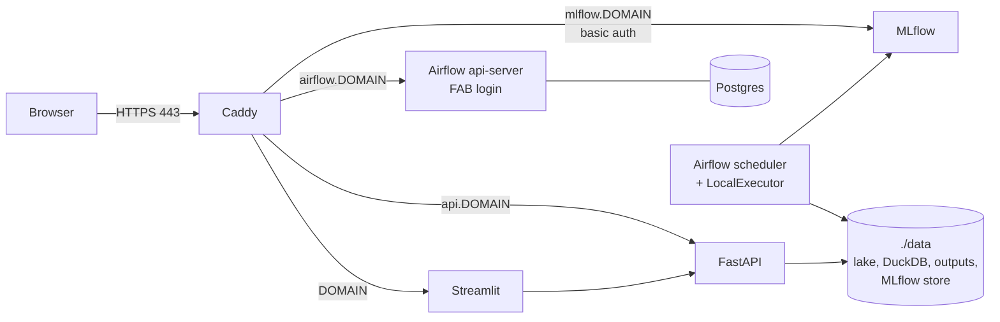

# Deploying to a single VPS (4-8 GB)

This guide runs the whole stack on one Linux VM: Airflow, MLflow, the API, the
dashboard and Caddy for HTTPS. It has **not been executed**. Provisioning a
VPS costs money and needs the owner's account, so every step below is for the
owner to run. The configuration files it uses (`deploy/docker-compose.prod.yml`
and `deploy/Caddyfile`) are validated in this repo: the merged Compose config
parses and `caddy validate` passes.



## 1. Size the machine

Measured with `docker stats` on the full stack (Colima, arm64):

| Service | Idle | Peak |
|---|---|---|
| airflow-scheduler (runs tasks, LocalExecutor) | 430 MB | 935 MB during the weekly backtest |
| airflow-apiserver | 255 MB | |
| airflow-dag-processor | 195 MB | |
| mlflow (1 worker, job consumers off) | 335 MB | |
| api | 165 MB | |
| dashboard | 70 MB | grows with concurrent sessions |
| postgres | 75 MB | |
| **Total** | **~1.7 GB** | **~2.3 GB** |

| | 4 GB RAM / 2 vCPU | 8 GB RAM / 4 vCPU (recommended) |
|---|---|---|
| Headroom at peak | ~1.5 GB after the OS | plenty |
| Notes | add 2-4 GB swap as a safety net | the override's limits fit as-is |
| Disk | 40 GB (data grows ~25 MB/month) | 40-80 GB |

Two settings matter for small machines, and both are already in
`docker-compose.yml`. MLflow runs with `--workers 1`, and
`MLFLOW_SERVER_ENABLE_JOB_EXECUTION=false` stops MLflow 3 from starting six
background job consumers (about 220 MB each) for GenAI features this project
doesn't use. With the defaults, MLflow alone used 2.1 GB.

Any provider works: Hetzner, DigitalOcean, Linode, OVH, Scaleway and so on.
Use Ubuntu 24.04 LTS.

## 2. Provision and harden

```bash
# as root on the new server
adduser deploy && usermod -aG sudo deploy
mkdir -p /home/deploy/.ssh && cp ~/.ssh/authorized_keys /home/deploy/.ssh/
chown -R deploy:deploy /home/deploy/.ssh

# SSH: keys only, no root login
sed -i 's/^#\?PasswordAuthentication .*/PasswordAuthentication no/' /etc/ssh/sshd_config
sed -i 's/^#\?PermitRootLogin .*/PermitRootLogin no/' /etc/ssh/sshd_config
systemctl restart ssh

# Firewall: only SSH and HTTP(S) are public
ufw default deny incoming && ufw default allow outgoing
ufw allow OpenSSH && ufw allow 80/tcp && ufw allow 443/tcp && ufw allow 443/udp
ufw enable

apt-get update && apt-get install -y unattended-upgrades fail2ban git make
dpkg-reconfigure -plow unattended-upgrades

# 4 GB machines: add swap as a safety net
fallocate -l 4G /swapfile && chmod 600 /swapfile && mkswap /swapfile && swapon /swapfile
echo '/swapfile none swap sw 0 0' >> /etc/fstab
```

Install Docker Engine and the Compose plugin from Docker's apt repository
(https://docs.docker.com/engine/install/ubuntu/), then
`usermod -aG docker deploy` and log in again as `deploy`.

> Docker publishes container ports straight through iptables, which bypasses
> ufw. That is why the production override binds everything except Caddy to
> `127.0.0.1`.

## 3. DNS

Point four A (and AAAA) records at the server: `DOMAIN`, `airflow.DOMAIN`,
`mlflow.DOMAIN` and `api.DOMAIN`. Caddy obtains Let's Encrypt certificates
automatically the first time each hostname is requested.

## 4. Configure

```bash
git clone https://github.com/ssabeeth/electricity.git && cd electricity
make env                      # creates .env with random secrets and your UID
docker run --rm caddy:2 caddy hash-password --plaintext 'choose-a-strong-password'
```

Edit `.env`:

| Variable | Value |
|---|---|
| `DOMAIN` | e.g. `power.example.com` |
| `ACME_EMAIL` | email for Let's Encrypt expiry notices |
| `BASIC_AUTH_USER` | user for MLflow (and optionally the API and dashboard) |
| `BASIC_AUTH_HASH` | the bcrypt hash from above, **with every `$` doubled to `$$`** |
| `AIRFLOW_ADMIN_USER` / `AIRFLOW_ADMIN_PASSWORD` | Airflow login (generated; change if you like) |

`chmod 600 .env`. It holds every secret and is git-ignored.

## 5. Start

```bash
docker compose -f docker-compose.yml -f deploy/docker-compose.prod.yml up -d --build
docker compose -f docker-compose.yml -f deploy/docker-compose.prod.yml ps
```

On first start the `elec_bootstrap` DAG runs once. It downloads three years of
history (about 10 minutes, a few thousand polite API requests), builds the dbt
project, runs the backtest, registers a champion model, simulates the battery
and issues the first forecast. Follow it at `https://airflow.DOMAIN`.

Airflow runs the most recent missed interval of each DAG when it first sees it,
so a daily forecast and a weekly retrain also run once at start-up. This is
safe: tasks that touch DuckDB queue behind each other in the `warehouse` pool,
and the daily forecast derives its delivery day from the run's own time.

## 6. Verify

- [ ] `https://airflow.DOMAIN` shows the Airflow login page; the admin user
      works; four DAGs are listed and `elec_bootstrap` succeeded.
- [ ] `https://mlflow.DOMAIN` asks for basic auth, then shows
      `elecprice-lgbm-quantile` with a `champion` alias.
- [ ] `https://api.DOMAIN/health` returns `"status": "ok"`; `/docs` loads.
- [ ] `https://DOMAIN` shows the dashboard with a forecast fan chart.
- [ ] From outside, `nc -zv SERVER 8080 5001 8000 8501 5432` all fail (bound to
      localhost only).

For the internal ports, use an SSH tunnel: `ssh -L 8080:localhost:8080 deploy@SERVER`.

## 7. Operate

**Updates.**

```bash
git pull && docker compose -f docker-compose.yml -f deploy/docker-compose.prod.yml up -d --build
```

**Backups.** Everything that matters is in `./data` plus the Airflow Postgres
database, which holds run history only and can be rebuilt. `./data/raw` alone
lets you rebuild the lake, the warehouse and the outputs offline. The MLflow
registry lives in `./data/mlflow-server`. Nightly, for example with restic to
object storage:

```bash
restic -r s3:https://<endpoint>/<bucket> backup /home/deploy/electricity/data \
  --exclude '/home/deploy/electricity/data/warehouse.duckdb'   # rebuildable
docker compose exec -T postgres pg_dump -U airflow airflow | gzip > airflow-$(date +%F).sql.gz
```

**Restore.** Restore `./data` and `.env`, then start as above. If the warehouse
was excluded from the backup, trigger `elec_bootstrap` from the Airflow UI. It
runs automatically on a fresh Postgres, and it rebuilds the warehouse from the
raw cache without re-downloading anything.

**Alerts.** Set `AIRFLOW__SMTP__*` and `default_args["email"]` in
`airflow/dags/elec_common.py` for failure emails. Add an external uptime check
(for example healthchecks.io or UptimeRobot) on `https://api.DOMAIN/health`.
The `elec_ingest` DAG fails loudly through `dbt source freshness` if any source
stops updating.

**Logs.** Rotated at 3 × 10 MB per container:
`docker compose logs -f airflow-scheduler`. Task logs are in the Airflow UI.

**Secrets rotation.** Change the value in `.env`, then `up -d`. For the Airflow
admin password, use `docker compose exec airflow-apiserver airflow users reset-password`.

## 8. Security notes

- Only Caddy is exposed publicly. Airflow, MLflow, the API, the dashboard and
  Postgres listen on the Docker network or on `127.0.0.1`.
- **Airflow**: its own login (FAB auth manager). Proxy basic auth is not layered
  on top because the Airflow 3 UI authenticates its API calls with
  `Authorization: Bearer` headers, which would clash. For a second layer, restrict
  `airflow.DOMAIN` by IP in the Caddyfile (`@allowed remote_ip ...`) or put it
  behind a VPN (for example Tailscale).
- **MLflow**: basic auth at the proxy. It can register and delete models, so it
  must never be public.
- **API and dashboard**: read-only views of forecasts made from public data;
  public by default. Add `import basic_auth` to their blocks to restrict them.
- Containers run as a non-root UID. The Docker socket is never mounted into any
  container.

## 9. Roll back

```bash
git checkout v0.8-containerise   # or any earlier tag
docker compose -f docker-compose.yml -f deploy/docker-compose.prod.yml up -d --build
```

To roll back a model, move the `champion` alias to an earlier version in the
MLflow UI (Models → elecprice-lgbm-quantile → Aliases). The next daily run uses
it.
