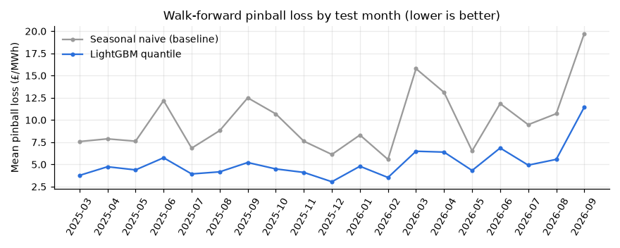
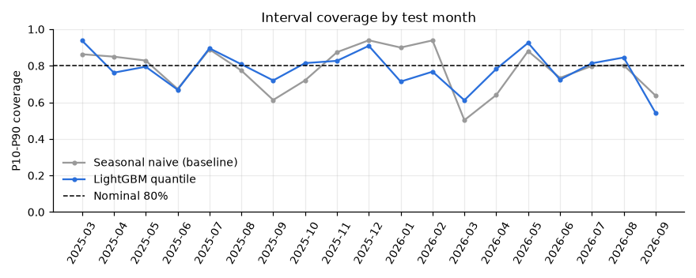
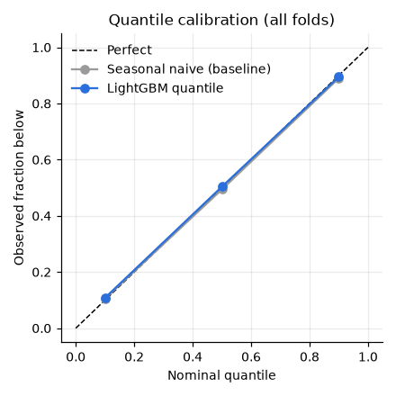
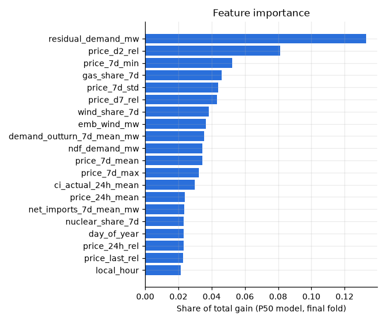

# Backtest report

_Generated by `elec backtest` on 2026-09-22 03:56 UTC. MLflow run `None`._

## Setup

- **Target:** Elexon Market Index Price (APXMIDP), £/MWh, half-hourly. It is
  not the day-ahead auction price, which is not freely available (see DECISIONS.md).
- **Decision cutoff:** 09:00 UK time on the day before delivery. Every feature
  comes from `mart_features`, whose point-in-time dbt test guarantees nothing
  was issued after the cutoff.
- **Walk-forward:** 19 expanding-window folds, one per calendar
  month from 2025-03 to 2026-09. Models
  are refitted each fold on every delivery day up to two days before the test
  month, with no shuffling. Training data starts 2024-03-01.
- **Model selection:** folds 1-6 were used to choose
  the target transform and the calibration variant. Folds after that are
  reported separately as fully out-of-sample.
- **Models:**
  - *Seasonal naive baseline:* P50 is the price at the same UK clock time one
    week earlier. P10/P90 add empirical residual quantiles per local hour.
  - *LightGBM quantile:* one model per quantile predicting price minus its
    trailing 7-day mean, then calibrated with a conformal shift estimated on
    the last 56 days of each training window.

## Headline results

| Scope | Model | Half-hours | Pinball | Skill vs baseline | MAE P50 | RMSE P50 | P10-P90 coverage | Interval width |
|---|---|---|---|---|---|---|---|---|
| All folds | LightGBM quantile | 27,344 | 5.05 | 48.4% | 15.48 | 22.90 | 78.7% | 46.1 |
| All folds | Seasonal naive (baseline) | 27,344 | 9.79 | 0.0% | 27.47 | 41.43 | 78.4% | 87.7 |
| Selection folds | LightGBM quantile | 8,820 | 4.45 | 47.4% | 13.58 | 19.24 | 81.3% | 43.6 |
| Selection folds | Seasonal naive (baseline) | 8,820 | 8.47 | 0.0% | 24.19 | 35.16 | 81.4% | 86.4 |
| Hold-out folds | LightGBM quantile | 18,524 | 5.34 | 48.7% | 16.39 | 24.45 | 77.5% | 47.4 |
| Hold-out folds | Seasonal naive (baseline) | 18,524 | 10.42 | 0.0% | 29.04 | 44.11 | 77.0% | 88.4 |

Across all folds the LightGBM model cuts mean pinball loss by
**48%** versus the baseline. MAE of the P50
falls from £27.47 to **£15.48/MWh**. The P10-P90
interval covers **78.7%** of outcomes (nominal 80%) while being
47% narrower than the
baseline's.

## Forecasts versus outcomes

## Calibration

The uncalibrated quantile models covered only about 55% of outcomes with their
P10-P90 interval. Quantile gradient-boosted models are overconfident out of
sample. The conformal shift brings coverage close to nominal and also lowers
pinball loss (see DECISIONS.md for the comparison).

## What drives the forecast

Top features by gain: `residual_demand_mw`, `price_d2_rel`, `price_7d_min`, `gas_share_7d`, `price_7d_std`.

## Per-fold metrics

| Test month | Pinball (baseline) | Pinball (LightGBM) | MAE (baseline) | MAE (LightGBM) | Coverage (baseline) | Coverage (LightGBM) |
|---|---|---|---|---|---|---|
| 2025-03 | 7.58 | 3.77 | 21.69 | 11.03 | 86.3% | 93.8% |
| 2025-04 | 7.88 | 4.74 | 22.36 | 14.77 | 85.0% | 76.2% |
| 2025-05 | 7.62 | 4.39 | 22.16 | 13.52 | 82.9% | 79.5% |
| 2025-06 | 12.19 | 5.76 | 36.61 | 17.67 | 67.3% | 66.9% |
| 2025-07 | 6.84 | 3.93 | 17.34 | 11.32 | 89.0% | 89.6% |
| 2025-08 | 8.81 | 4.17 | 25.39 | 13.37 | 77.4% | 80.8% |
| 2025-09 | 12.50 | 5.22 | 36.07 | 15.13 | 61.3% | 72.0% |
| 2025-10 | 10.69 | 4.50 | 30.04 | 13.75 | 72.0% | 81.5% |
| 2025-11 | 7.62 | 4.11 | 21.01 | 13.12 | 87.4% | 82.7% |
| 2025-12 | 6.13 | 3.05 | 15.19 | 9.14 | 94.0% | 90.9% |
| 2026-01 | 8.32 | 4.80 | 21.37 | 15.14 | 90.0% | 71.4% |
| 2026-02 | 5.57 | 3.53 | 14.97 | 12.00 | 93.9% | 76.8% |
| 2026-03 | 15.78 | 6.49 | 44.38 | 20.32 | 50.3% | 61.2% |
| 2026-04 | 13.12 | 6.39 | 36.27 | 20.11 | 64.0% | 78.3% |
| 2026-05 | 6.53 | 4.32 | 18.77 | 13.46 | 88.0% | 92.5% |
| 2026-06 | 11.85 | 6.85 | 31.73 | 19.89 | 73.4% | 72.4% |
| 2026-07 | 9.48 | 4.93 | 27.44 | 15.28 | 79.9% | 81.4% |
| 2026-08 | 10.71 | 5.57 | 32.74 | 17.88 | 80.3% | 84.5% |
| 2026-09 | 19.74 | 11.46 | 54.61 | 32.71 | 63.7% | 54.2% |

## Caveats

- There is no gas price input. Gas sets the marginal price most of the time, and
  no free API offers a point-in-time series. The model tracks the price level
  through recent-price features instead, which lags sharp moves in gas.
  Months where the level shifts (for example 2026-09) score worst.
- MID is a short-term traded index, so its volatility is not identical to the
  day-ahead auction's.
- Monthly refitting approximates the weekly retrain in production.
