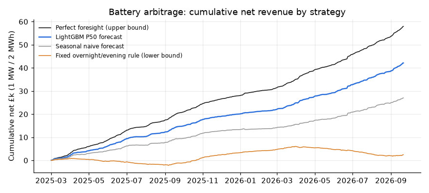
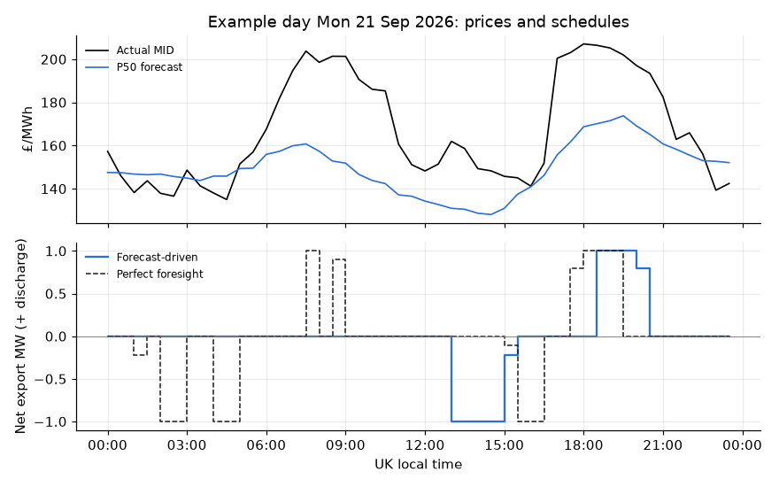

# Battery arbitrage simulation

_Generated by `elec simulate`. 568 delivery days,
2025-03-01 to 2026-09-21: every day of the
walk-forward backtest with settled prices._

## What is being simulated

A merchant battery trades the GB Market Index Price. Each day it commits to a
half-hourly charge and discharge schedule at the 09:00 D-1 cutoff and is paid
the actual price. Four strategies share the same asset and constraints:

- **Perfect foresight:** optimises on the actual prices. No strategy can beat
  this; it is the upper bound.
- **LightGBM P50 forecast:** optimises on the out-of-sample P50 forecast from
  the walk-forward backtest.
- **Seasonal naive forecast:** optimises on "same half-hour last week".
- **Fixed rule:** price-blind. It charges 01:00-05:00 and discharges
  16:30-19:30 UK time every day; this is the lower bound.

Schedules come from a linear programme (pulp + HiGHS, `battery/optimise.py`).
Settlement is a separate function: schedules only ever see decision prices.

| Parameter | Value |
|---|---|
| Power | 1.0 MW |
| Usable energy | 2.0 MWh |
| Round-trip efficiency | 90% (half the loss each way) |
| State of charge | starts and ends each day at 0% |
| Cycle limit | 1.5 full-equivalent cycles per day |
| Degradation cost | £10 per MWh discharged |

## Results

| Strategy | Net £ | Net £/MW/yr | Share of perfect foresight | Share of gap closed | Cycles/day |
|---|---|---|---|---|---|
| Perfect foresight (upper bound) | £57,940 | £37,232 | 100.0% | 100.0% | 1.26 |
| LightGBM P50 forecast | £42,128 | £27,072 | 72.7% | 71.5% | 1.19 |
| Seasonal naive forecast | £27,036 | £17,373 | 46.7% | 44.3% | 1.26 |
| Fixed overnight/evening rule (lower bound) | £2,450 | £1,574 | 4.2% | 0.0% | 1.00 |

"Share of gap closed" places each strategy between the fixed rule (0%) and
perfect foresight (100%).

The forecast-driven battery earns **73% of the
perfect-foresight revenue**. That is £42,128, against
£27,036 when scheduling on the naive forecast. The better forecast
is worth about **£9,698 per MW per year** on this asset, before any
other revenue stream.

The example below is the latest settled day (2026-09-21): the forecast
schedule against the perfect-foresight one.

## Monthly net revenue (£)

| Month | Perfect foresight (upper bound) | LightGBM P50 forecast | Seasonal naive forecast | Fixed overnight/evening rule (lower bound) |
|---|---|---|---|---|
| 2025-03 | 2,937 | 2,073 | 1,453 | 793 |
| 2025-04 | 3,056 | 2,070 | 1,565 | -379 |
| 2025-05 | 2,741 | 2,025 | 1,179 | -831 |
| 2025-06 | 4,081 | 3,083 | 1,940 | -293 |
| 2025-07 | 1,790 | 1,066 | 475 | -799 |
| 2025-08 | 2,673 | 1,822 | 1,016 | -430 |
| 2025-09 | 3,632 | 2,739 | 1,897 | 840 |
| 2025-10 | 3,526 | 2,714 | 2,151 | 2,233 |
| 2025-11 | 2,100 | 1,417 | 1,111 | 1,256 |
| 2025-12 | 1,483 | 1,069 | 543 | 922 |
| 2026-01 | 1,969 | 1,088 | 262 | 804 |
| 2026-02 | 1,375 | 864 | 536 | 617 |
| 2026-03 | 3,680 | 2,828 | 1,448 | 1,289 |
| 2026-04 | 4,056 | 2,787 | 1,647 | -614 |
| 2026-05 | 2,330 | 1,631 | 1,036 | -682 |
| 2026-06 | 4,410 | 3,469 | 2,624 | -500 |
| 2026-07 | 3,784 | 2,982 | 1,965 | -1,413 |
| 2026-08 | 3,821 | 2,767 | 1,899 | -779 |
| 2026-09 | 4,493 | 3,634 | 2,289 | 417 |

## Caveats

- **Price taker with perfect liquidity at MID.** Real day-ahead positions clear
  in auctions (not free data) and move the price slightly. MID is a proxy.
- **Wholesale arbitrage only.** No Balancing Mechanism, ancillary services or
  capacity market income, which dominate real GB battery revenues. The numbers
  are the value of *forecast-driven day-ahead arbitrage*, not a full business
  case.
- **Days are independent.** State of charge resets daily, so overnight
  positions spanning two delivery days are not optimised.
- **Degradation is linear in throughput.** This is a common simplification;
  real degradation also depends on depth of discharge, temperature and C-rate.
- **The optimiser uses the P50 only.** A risk-aware schedule that also uses the
  P10/P90 is a natural extension.
