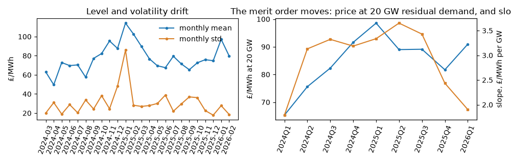
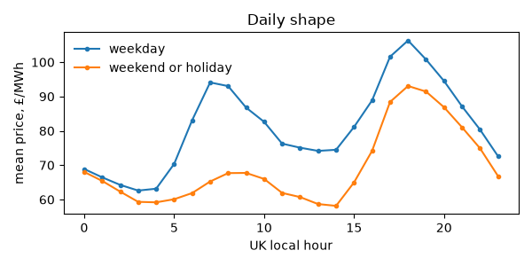
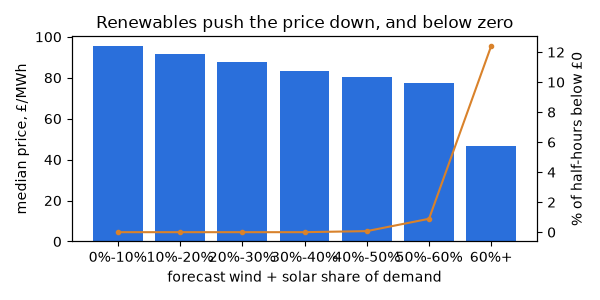
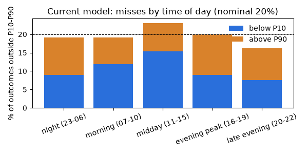

# Data patterns and what they imply

_Generated by `elec patterns`. Delivery days 2024-03-01 to 2026-02-28: the training history and the selection folds. The hold-out months (from 2026-03-01) are not read._

Each section states a pattern, the evidence, and what it implies for the model. [experiments.md](experiments.md) tests every implication that is a change to the current model, under a rule fixed before any experiment ran.

## 1. Heavy tails and negative prices

Over 35,028 half-hours the price has skew 6.0 and excess kurtosis 174. The middle 80% runs from £34 to £109/MWh, but the maximum is £1,353, 2.7% of half-hours are below zero, and the mean sits £2.7 below the median: the spikes and the negative prices pull in opposite directions.

**Implies:** a squared-error model would chase the few spikes. Quantile (pinball) loss is robust to them and gives the P10 and P90 the battery and the reader need, so the model predicts quantiles and is scored on pinball loss. Intervals from a symmetric error model would be wrong on both sides; the experiments include a point model with empirical residual intervals to check that direct quantile models earn their keep.

## 2. The level drifts, and the merit order moves with it

Monthly mean prices range from £50 (2024-04) to £114 (2025-01). The level is set by the fuel cost of the marginal plant, which is mostly gas, and there is no free point-in-time gas price. The clearest trace of it is the price at a fixed residual demand: at 20 GW it rose from £65 (2024Q1) to £99 (2025Q1), and the slope of price against residual demand ranged from £1.8 to £3.7/MWh per GW.

| Quarter | Half-hours | Price at 20 GW | Slope per GW | Spearman with residual demand | Gas share |
|---|---|---|---|---|---|
| 2024Q1 | 1,486 | £65.3 | £1.79 | 0.58 | 36% |
| 2024Q2 | 4,367 | £75.6 | £3.13 | 0.60 | 31% |
| 2024Q3 | 4,416 | £82.3 | £3.32 | 0.66 | 31% |
| 2024Q4 | 4,418 | £91.6 | £3.19 | 0.76 | 40% |
| 2025Q1 | 4,318 | £98.6 | £3.34 | 0.71 | 43% |
| 2025Q2 | 4,358 | £89.0 | £3.65 | 0.64 | 33% |
| 2025Q3 | 4,377 | £89.1 | £3.43 | 0.60 | 34% |
| 2025Q4 | 4,418 | £81.7 | £2.43 | 0.73 | 35% |
| 2026Q1 | 2,832 | £90.9 | £1.90 | 0.58 | 38% |

**Implies:** trees cannot extrapolate a level they have not seen, which is why the model already learns the price minus its trailing 7-day mean. Three experiments follow from the moving curve: a *recent merit order* feature (the price the last two weeks' curve implies for tomorrow's residual demand), *recency weighting* of training rows, and a *rolling one-year window* instead of the expanding one.

## 3. Residual demand is the strongest single signal

Rank correlation with the price (Spearman), over the same period: residual demand 0.65 on average across quarters, against 0.53 for the same half-hour two days earlier and 0.48 for last week's. Within every quarter the price rises with residual demand.

**Implies:** residual demand (the NESO demand forecast minus the wind forecast) stays the core input, and the relationship is monotone, so an experiment constrains the trees to be *monotone in residual demand*, which should help most where the training data is thin (the extremes).

## 4. The daily shape repeats

On weekdays the 16:00-19:59 evening peak averages £18.2 above the daily mean; weekends and holidays average £11.9 below weekdays. The shape of a day (each half-hour minus the day's mean) correlates with the same weekday's shape a week earlier at a median of 0.61, and with two days earlier at 0.59.

**Implies:** the calendar features and the D-2 and D-7 same-period lags already carry the shape. One experiment adds a smoother version, the *same half-hour's mean over the last seven known days*, which is less noisy than any single lag.

## 5. Persistence: which lags carry information

| Lag | Known at the cutoff | Spearman with price | MAE used as a forecast |
|---|---|---|---|
| `price_d1_same_period` | 33.3% | 0.50 | £20.76 |
| `price_d2_same_period` | 100.0% | 0.53 | £23.50 |
| `price_d7_same_period` | 100.0% | 0.48 | £25.04 |
| `price_24h_mean` | 100.0% | 0.40 | £23.36 |
| `price_7d_mean` | 100.0% | 0.39 | £22.00 |

At a 09:00 cutoff only the early-morning half-hours of D-1 are known, so the D-1 lag is missing for most rows by design. The same half-hour two days earlier is a better naive forecast than a week earlier.

**Implies:** the brief's baseline (same half-hour last week) is kept as the reference, and the model comparison adds the D-2 naive as a second, stronger naive, so the model's skill is not flattered by a weak baseline.

## 6. Renewables set the bottom of the distribution

| Forecast wind + solar share of demand | Half-hours | Median price | Below £0 | P90 - P10 |
|---|---|---|---|---|
| 0%-10% | 983 | £95.5 | 0.0% | £95.9 |
| 10%-20% | 4,122 | £91.6 | 0.0% | £54.2 |
| 20%-30% | 5,530 | £87.8 | 0.0% | £47.0 |
| 30%-40% | 6,519 | £83.4 | 0.0% | £43.9 |
| 40%-50% | 5,760 | £80.5 | 0.1% | £46.6 |
| 50%-60% | 4,596 | £77.6 | 0.9% | £59.2 |
| 60%+ | 7,385 | £46.6 | 12.4% | £88.5 |

**Implies:** the model sees the wind, solar and demand forecasts separately; negative prices come from their ratio. An experiment adds the *forecast renewable share* directly, so a tree can split on it in one step.

## 7. Volatility persists for days, not weeks

The log of a day's price standard deviation (log, because one spike dominates a day's standard deviation) correlates with the previous day's at 0.41, with a week earlier at 0.17 and with four weeks earlier at 0.06. Monthly standard deviations range from £18 to £86.

**Implies:** the width of tomorrow's interval should follow the last few days, which the model sees through `price_7d_std`, while the conformal calibration averages the last 56 days. An experiment tries a *28-day calibration window*, which follows volatility faster but estimates each shift from half the data.

## 8. Where the current model misses

On the selection folds of the saved backtest, by UK time of day:

| Hours | Half-hours | P10-P90 coverage | Below P10 | Above P90 | MAE P50 |
|---|---|---|---|---|---|
| night (23-06) | 5,833 | 80.8% | 8.9% | 10.2% | £12.92 |
| morning (07-10) | 2,918 | 80.9% | 11.9% | 7.1% | £14.09 |
| midday (11-15) | 3,648 | 76.9% | 15.3% | 7.8% | £14.67 |
| evening peak (16-19) | 2,920 | 80.1% | 9.0% | 10.9% | £13.74 |
| late evening (20-22) | 2,190 | 83.7% | 7.5% | 8.7% | £10.54 |

The two tails are most unbalanced in the midday (11-15): 15.3% of outcomes fall below the P10 (nominal 10%). One calibration shift per quantile cannot fix a miss that depends on the time of day.

**Implies:** an experiment estimates the conformal shifts *per time-of-day group* instead of once.

## 9. The inputs drift between years

A classifier trained to tell 2024-03 to 2025-02 from 2025-03 to 2026-02 on the non-calendar inputs, with every third calendar month held out whole, reaches ROC-AUC 0.74 (0.5 would mean the years look alike). The inputs that give the year away:

| Feature | Share of the classifier's gain | First year mean | Second year mean |
|---|---|---|---|
| `nuclear_share_7d` | 29.7% | 0.197 | 0.165 |
| `price_7d_max` | 18.6% | 168 | 144 |
| `demand_outturn_7d_mean_mw` | 16.2% | 2.65e+04 | 2.61e+04 |
| `price_7d_mean` | 15.4% | 78.1 | 76.9 |
| `net_imports_7d_mean_mw` | 5.3% | 3.76e+03 | 3.17e+03 |
| `wind_share_7d` | 3.2% | 0.307 | 0.338 |

The non-price inputs among them with more than 5% of the gain are slow-moving system state: `nuclear_share_7d`, `demand_outturn_7d_mean_mw`, `net_imports_7d_mean_mw`. Without them the classifier's ROC-AUC falls to 0.65. (Holding out single days instead gives 1.00, because a held-out day's 7-day inputs are nearly its neighbours'.)

**Implies:** a tree can use slow system state as a marker of the year rather than as a cause of the price. An experiment *drops these regime markers*. The drift in price levels is what the de-levelled target and the relative price lags already handle.

## Missing values

Inputs missing on more than 0.1% of half-hours (LightGBM routes missing values down a learned branch, so nothing is imputed):

| Feature | Missing |
|---|---|
| `price_d1_same_period` | 66.7% |
| `price_d1_rel` | 66.7% |
| `emb_wind_mw` | 0.3% |
| `emb_solar_mw` | 0.3% |
| `emb_solar_load_factor` | 0.3% |
| `ndf_demand_mw` | 0.1% |
| `residual_demand_mw` | 0.1% |
